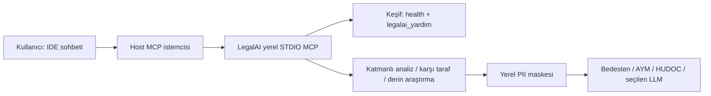

Geliştirme aşamasındadır. 

Copyright (c) 2025 saidsurucu [Yargı MCP - https://github.com/saidsurucu/yargi-mcp?tab=MIT-1-ov-file]
## LegalAI kullanim ve kesif

LegalAI yerel STDIO MCP sunucusudur. MCP'ye baglandiktan sonra kullanici arac adlarini ezberlemeden dogal dilde istekte bulunabilir veya `legalai_yardim` aracindan mevcut yetenekleri ve ornek promptlari alabilir. Kurulum, istemci ayarlari, yalindan rafine analize ornekler ve privacy-first kurali icin [docs/mcp-client-setup.md](docs/mcp-client-setup.md) dosyasina bakin.

## Week 11: IDE-first hızlı başlangıç

LegalAI'nin ana kullanım yüzeyi yerel IDE/MCP istemcisidir. Codex, Cursor, Claude, Antigravity ve VS Code'da aynı yerel STDIO kaydıyla çalışır; CLI yalnızca yardımcı bir kanaldır.

### Beş dakikada deneme

```powershell
uv sync --frozen --dev
uv run legalai-mcp
```

IDE'nin MCP araçları bölümünde önce `legalai_saglik_kontrolu`, ardından `legalai_yardim` aracını çalıştırın. Bağlantı sonucu `status=ok` ve `external_calls=false` olmalıdır. Daha sonra sohbet alanına doğal dilde soru yazabilirsiniz; araç adlarını bilmeniz gerekmez.

### Basit mimari



### Dört ana kullanım alanı

- **Katmanlı analiz:** Soru, tarih, süre, görev/yetki ve içtihat değerlendirmesi.
- **Agresif karşı taraf:** Karşı argümanlar, karşıt içtihatlar ve dava dışı çözüm yolları.
- **Derin araştırma:** Karmaşık soruyu alt sorulara bölme ve kaynakları karşılaştırma.
- **Kaynak ve gizlilik:** Atıf doğrulama ve dış çağrılardan önce yerel PII maskeleme.

Kullanım seviyeleri `Yalın`, `Yönlendirilmiş` ve `Rafine` olarak seçilebilir. Ayrıntılı IDE adımları için [docs/week11-demo.md](docs/week11-demo.md) dosyasına, katkı kuralları için [CONTRIBUTING.md](CONTRIBUTING.md) dosyasına bakın.

Yardımcı CLI örneği:

```powershell
uv run legalai qa "Bu olay için görevli mahkeme ve süre risklerini kaynaklı analiz et"
```

Çıktılar `analysis_only` ve `non_binding` niteliğindedir; kesin veya bağlayıcı hukukî görüş değildir.
